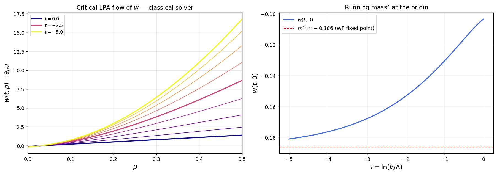
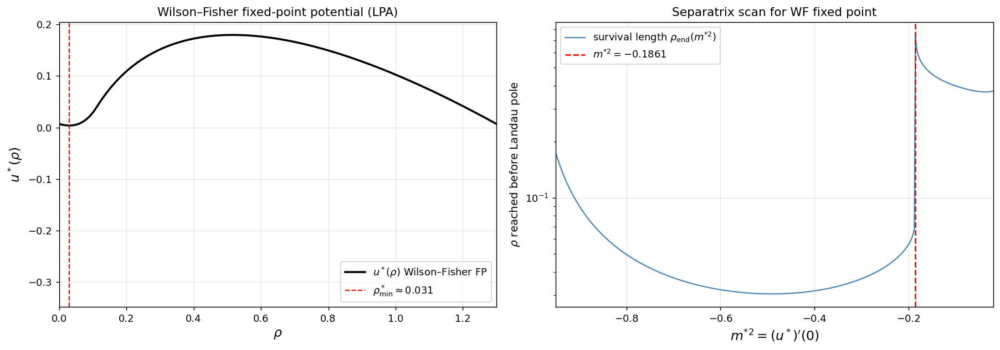
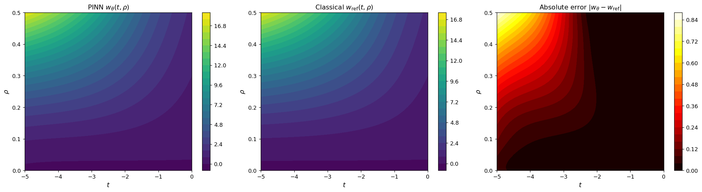
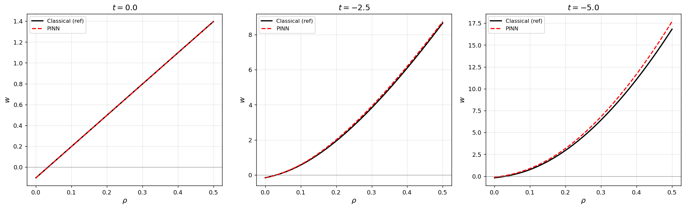
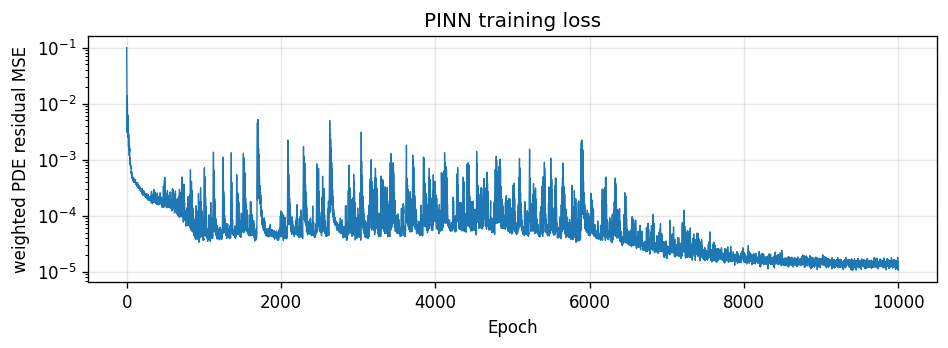

# Physics-Informed Neural Network for the Wetterich Equation

**Solving the exact functional renormalization group (FRG) flow of a scalar field theory with a PINN, benchmarked against a classical PDE solver and the Wilson–Fisher fixed point.**

The [Wetterich equation](https://doi.org/10.1016/0370-2693(93)90726-X) is the exact flow equation for the effective average action $\Gamma_k$ of a quantum field theory as a function of the coarse-graining scale $k$:

$$\partial_t \Gamma_k = \frac{1}{2}\text{Tr}\left[\left(\Gamma_k^{(2)} + R_k\right)^{-1}\partial_t R_k\right], \qquad t = \ln\frac{k}{\Lambda}$$
$$

This repo solves it for a single-component scalar field in $d=3$ — the universality class of the 3D Ising model — in two independent ways:

1. **Classical solver**: method-of-lines finite differences + LSODA time integration (ground truth),
2. **PINN**: a small tanh network trained on the PDE residual via automatic differentiation,

and cross-checks both against the **Wilson–Fisher fixed point**, obtained separately by shooting on the fixed-point ODE.

Everything lives in a single, self-contained notebook: [`pinn_frg_wetterich.ipynb`](pinn_frg_wetterich.ipynb) (runs on CPU in a few minutes; only PyTorch, NumPy, SciPy, Matplotlib).

---

## 1. The physics problem

In the **Local Potential Approximation (LPA)**, $\Gamma_k = \int d^3x\left[\tfrac{1}{2}(\partial\varphi)^2 + U_k(\rho)\right]$ with $\rho = \varphi^2/2$, and with the **Litim optimised regulator** $R_k(q^2) = (k^2 - q^2)\,\Theta(k^2 - q^2)$ the trace can be done analytically. The Wetterich equation reduces to a nonlinear parabolic PDE for the dimensionless potential $u(t,\rho)$:

$$\partial_t u = -3u + \rho\,\partial_\rho u + \frac{C}{1 + \partial_\rho u + 2\rho\,\partial_\rho^2 u}, \qquad C = \frac{1}{6\pi^2}$$

Flowing from the UV ($t=0$, bare $\varphi^4$ theory) to the IR ($t\to-\infty$), the potential interpolates between microscopic and macroscopic physics. On the **critical surface** the flow converges to the **Wilson–Fisher fixed point**, which controls the second-order phase transition of the 3D Ising universality class.

## 2. Implementation choices (what actually makes this work)

Solving an RG flow with a PINN is harder than a textbook heat equation, and three choices are essential:

### (a) Flow $w = \partial_\rho u$, not $u$
Away from criticality the dimensionless potential grows like $u \sim e^{-3t}$, reaching $|u| \sim 10^5$ at $t=-5$ — impossible for a tanh network with $O(1)$ outputs. Differentiating once in $\rho$ removes the volume term $-3u$ and gives the standard flow for the mass function $w = \partial_\rho u$:

$$\partial_t w = -2w + \rho\,\partial_\rho w - \frac{C\left(3\partial_\rho w + 2\rho\,\partial_\rho^2 w\right)}{\left(1 + w + 2\rho\,\partial_\rho w\right)^2}$$

### (b) Tune the initial condition to criticality
The UV condition is a bare $\varphi^4$ potential, $w(0,\rho) = \lambda(\rho - \kappa_0)$ with $\lambda = 3$, and $\kappa_0$ is tuned to the phase boundary **by bisection** ($\kappa_c \approx 0.034450$). This matters because:

- $\kappa_0 < \kappa_c$ (symmetric phase): the mass runs off, $w \sim e^{-2t}$ — unbounded;
- $\kappa_0 > \kappa_c$ (broken phase): the threshold denominator $1 + w + 2\rho\,\partial_\rho w$ hits a Landau pole at finite $t$ (convexification) and the equation becomes ill-conditioned;
- $\kappa_0 = \kappa_c$: the flow converges to the Wilson–Fisher fixed-point profile and stays smooth, bounded, and pole-free on the whole domain — the PINN-friendly regime.

### (c) PINN design
The network is a plain MLP $\mathcal{N}_\theta$ (4 hidden layers × 64 units, tanh, ~12.7k parameters) wrapped with a **hard initial-condition encoding**

$$w_\theta(t,\rho) = w_\mathrm{UV}(\rho) + (-t)\cdot s\,\mathcal{N}_\theta(t,\rho),$$

so $w_\theta(0,\rho) = w_\mathrm{UV}(\rho)$ holds exactly for any weights — no IC penalty term to balance. Training minimises the weighted PDE residual (all derivatives via `torch.autograd`):

$$\mathcal{L} = \frac{1}{N}\sum_i \omega_i^2\,\big[\text{PDE residual at }(t_i,\rho_i)\big]^2, \qquad \omega_i = \frac{1}{1 + |w_\theta|}$$

with two tricks that matter specifically for RG flows:

- **Time-marching curriculum**: collocation points are sampled from a window $t \in [t_\mathrm{lo}(\text{epoch}),\,0]$ that expands from the UV toward the IR. Residual errors made early in $t$ are amplified exponentially ($\sim e^{2|t|}$) along the flow, so the network must learn the solution *causally*.
- **Residual weighting** $1/(1+|w|)$: $w$ ranges from $\approx -0.2$ near the origin to $\approx 17$ at the outer boundary in the IR; without the weight the loss is dominated by the (physically trivial) large-$\rho$ tail.

Optimisation: 10,000 Adam epochs (cosine LR schedule, 1024 collocation points/epoch) followed by a full-batch **L-BFGS polish**. Final residual loss ≈ 1.4×10⁻⁵.

## 3. Classical reference solution

The $w$-flow is discretised on a uniform $\rho$-grid (200 points, second-order central differences) and integrated in $t$ with `scipy.integrate.solve_ivp` (LSODA, stiffness-switching). The running mass $w(t,0)$ flows into the Wilson–Fisher value $m^{*2} \approx -0.186$, and the IR potential minimum sits at $\rho^* \approx 0.031$ — both matching the independent fixed-point computation.



As a second, fully independent check, the **fixed-point ODE** ($\partial_t u^* = 0$) is solved by shooting from $\rho = 0$ with a regularity expansion; the Wilson–Fisher fixed point sits on the separatrix between Landau-pole trajectories. This reproduces the known LPA critical exponent $\nu_\mathrm{LPA} = 0.6491$ (vs. 0.6304 from Monte Carlo).



## 4. Results: classical vs. PINN

Full solution over the $(t,\rho)$ domain — PINN, classical reference, and absolute error:



Slices at fixed RG time, from the UV ($t=0$, exact by construction) through the crossover to the deep IR ($t=-5$):



| Metric (PINN vs. classical) | Value |
|---|---|
| Mean absolute error | 1.1×10⁻¹ |
| Max absolute error | 8.7×10⁻¹ (outer boundary, IR) |
| **Relative MAE** | **3.5%** |
| Final PDE residual loss | 1.4×10⁻⁵ |

Training loss (note the bumps as the time-marching window expands toward the IR):



## 5. Running it

```bash
pip install torch numpy scipy matplotlib jupyter
jupyter notebook pinn_frg_wetterich.ipynb
```

No GPU required — the full notebook (bisection to criticality, fixed-point shooting, 10k-epoch PINN training) runs on a laptop CPU in a few minutes.

## 6. Outlook

- **LPA′**: include the running wavefunction renormalisation $Z_k \neq 1$ → anomalous dimension $\eta \neq 0$ and improved $\nu$;
- **Derivative expansion / BMW** to order $\partial^4$, approaching exact results;
- **$O(N)$ fields**: the threshold function acquires a Goldstone contribution $(N-1)/(1+u')$;
- Parametric PINNs: train $w_\theta(t,\rho;\kappa_0)$ across the phase transition in one network.

## References

1. C. Wetterich, *Exact evolution equation for the effective potential*, Phys. Lett. B **301** (1993) 90.
2. J. Berges, N. Tetradis, C. Wetterich, *Non-perturbative renormalization flow in quantum field theory and statistical physics*, Phys. Rep. **363** (2002) 223.
3. D. F. Litim, *Optimized renormalization group flows*, Phys. Rev. D **64** (2001) 105007.
4. B. Delamotte, *An introduction to the nonperturbative renormalization group*, [arXiv:cond-mat/0702365](https://arxiv.org/abs/cond-mat/0702365).
5. M. Raissi, P. Perdikaris, G. E. Karniadakis, *Physics-informed neural networks*, J. Comput. Phys. **378** (2019) 686.

## License

MIT — see [LICENSE](LICENSE).
